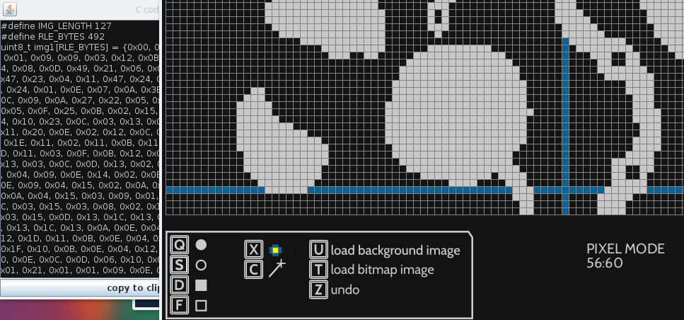

Graphical u8glib editor in Processing

generates C u8glib instructions for monochrome screens

runs as a Processing sktech (processing.org)

Features:
- Run Length Encoding compression for imported images
- image import for tracing
- variable target screen size (default 128x64)
- 1:1 preview

Missing features:
- freehand drawing
- save/load

